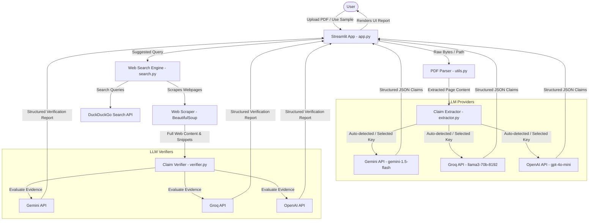
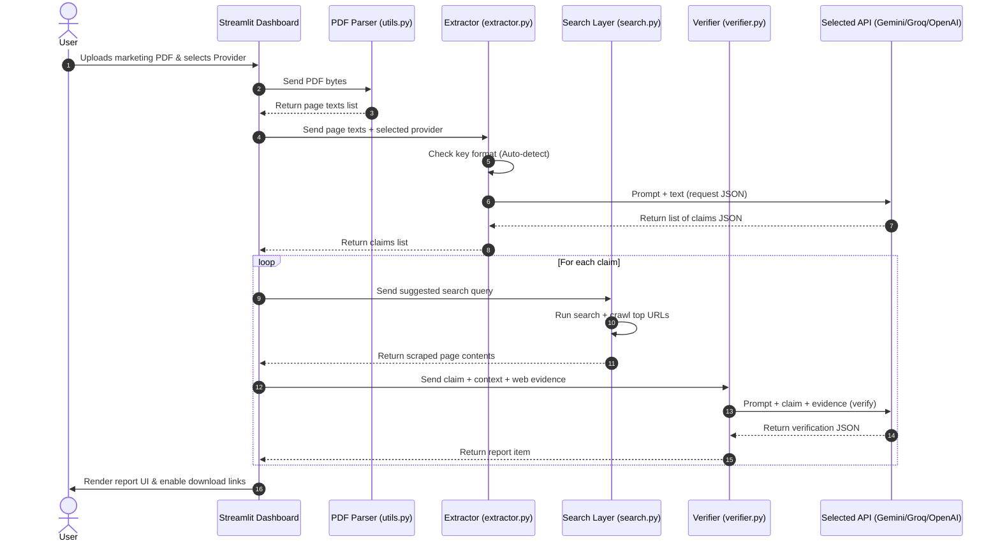
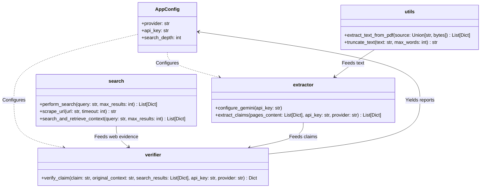

# 🛡️ TruthLayer: Multi-LLM Fact-Checking AI Agent & Live Verification Engine

TruthLayer is a production-ready, AI-driven fact-checking application designed to act as an auditing layer for marketing publications, investment pitches, presentations, and documents. By processing uploaded PDFs, extracting structured claims, executing real-time web searches, and analyzing sources, TruthLayer separates verified data from hallucinations, outdated numbers, and unsupported assertions.

---

## 🎯 Features

- **Automated Claim Extraction**: Parses PDFs page-by-page using PyMuPDF and utilizes the selected LLM provider to isolate percentages, statistics, dates, market size claims, financial figures, and technical metrics.
- **Multi-LLM Provider Engine**:
  - **Google Gemini**: Uses `gemini-1.5-flash` for token-efficient extraction and verification.
  - **Groq**: Uses `llama3-70b-8192` for ultra-fast, low-latency evaluations.
  - **OpenAI**: Uses `gpt-4o-mini` for highly reliable reasoning and parsing compliance.
- **Intelligent API Auto-Detection**:
  * Automatically detects key formats: keys starting with `gsk_` route to **Groq**, keys starting with `sk-` route to **OpenAI**, and others route to **Google Gemini**.
- **Live Search & Scrape Layer**: Formulates neutralized queries, runs live searches on DuckDuckGo Search, and crawls the top destination pages using BeautifulSoup to extract evidence.
- **Audit Verification Ledger**: Interactive Streamlit dashboard showing statistics, filtered reports, confidence gauges, corrected assertions, and clickable source links.
- **Audit Exports**: Download generated verification reports as structured CSV or JSON files.

---

## 🏗️ Architecture Diagrams

### 1. System Architecture


### 2. Data Flow Diagram


### 3. Component Diagram


---

## ⚙️ Installation & Setup

1. **Clone the Repository**:
   ```bash
   git clone https://github.com/akshaysharma2703/fact-check-agent.git
   cd fact-check-agent
   ```

2. **Set up Virtual Environment**:
   ```bash
   python -m venv venv
   source venv/bin/activate  # On Windows: venv\Scripts\activate
   ```

3. **Install Dependencies**:
   ```bash
   pip install -r requirements.txt
   ```

4. **Configure API Keys**:
   Create a `.env` file in the root directory:
   ```env
   # Add the keys you plan to use
   GROQ_API_KEY=gsk_your_groq_api_key
   OPENAI_API_KEY=sk-your_openai_api_key
   GEMINI_API_KEY=your_gemini_api_key
   ```
   *Note: If these keys are in your `.env` or system environment, the Streamlit app will load them automatically in the sidebar.*

5. **Run the Application**:
   ```bash
   streamlit run app.py
   ```

---

## 🧪 Testing Instructions

To validate the fact-checking engine against fake statistics, use the programmatically compiled PDF:

1. Run the generator script:
   ```bash
   python generate_trap_pdf.py
   ```
2. Upload the newly generated `trap_marketing_report.pdf` into the app.
3. Observe how the system reacts:
   - **Verified**: "Python released in 1991" / "Earth orbit completes in 365.25 days".
   - **False/Inaccurate**: "Paris population exactly 140 million" / "Eiffel Tower stands 3,000 meters tall in Rome".


---

## 🔮 Future Improvements

- **Async Multi-threading**: Run web searches and verifications for all extracted claims concurrently to reduce total evaluation latency.
- **Reference Document Uploader**: Allow users to upload their own internal reference database (PDFs, spreadsheets) to verify statements against corporate files rather than public search engines.
- **API integrations**: Connect to Slack, Google Drive, and HubSpot to automate compliance review of outgoing sales collateral.
